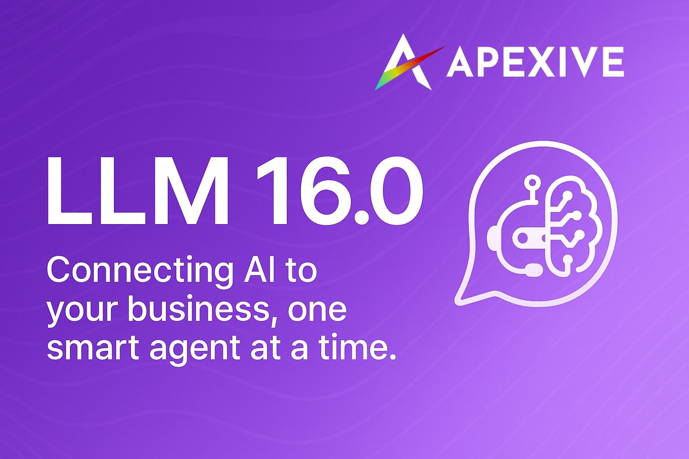

# Odoo LLM Integration



This repository provides a comprehensive framework for integrating Large Language Models (LLMs) into Odoo. It allows seamless interaction with various AI providers including OpenAI, Anthropic, Ollama, and Replicate, enabling chat completions, text embeddings, and more within your Odoo environment.

## 🚀 Features

- **Multiple LLM Provider Support**: Connect to OpenAI, Anthropic, Ollama, LiteLLM proxy, and Replicate
- **Unified API**: Consistent interface for all LLM operations regardless of provider
- **Chat UI**: Modern, responsive interface with real-time message streaming
- **Thread Management**: Organize and manage AI conversations
- **Model Management**: Configure and use different models for various tasks
- **Security**: Role-based access control and proper API key management

## 📦 Modules

| Module          | Description                                                          |
|-----------------|----------------------------------------------------------------------|
| `llm`           | Base module with core functionality and provider framework           |
| `llm_tool`     | Adds tool functionality that allows LLMs to perform actions in Odoo  |
| `llm_thread`    | Chat threads and conversation management                             |
| `llm_openai`    | OpenAI (GPT) provider integration                                    |
| `llm_anthropic` | Anthropic (Claude) provider integration                              |
| `llm_ollama`    | Ollama provider for local model deployment                           |
| `llm_litellm`   | LiteLLM proxy for centralized model management                       |
| `llm_replicate` | Replicate.com integration                                            |

## 🛠️ Installation

1. Clone this repository into your Odoo addons directory:
   ```bash
   git clone https://github.com/apexive/odoo-llm
   ```

2. Install required dependencies:
   ```bash
   pip install -r requirements.txt
   ```

3. Install the base module and desired provider modules through the Odoo Apps menu

## ⚙️ Configuration

After installation:

1. Navigate to LLM → Configuration → Providers
2. Create a new provider with your API credentials
3. Set up models for the provider (can be done automatically using "Fetch Models")
4. Grant appropriate access rights to users

## 🔄 LLM Tools: Building AI-Driven ERP

We're seeing tremendous potential by integrating reasoning/agent models like ChatGPT, Claude, and others into Odoo. These models can query the Odoo database via functions and interact with server actions for data manipulation.

### Why This Matters

This approach has the potential to revolutionize how users interact with Odoo:
- AI-driven automation of repetitive tasks
- Smart querying & decision-making inside Odoo
- A flexible ecosystem for custom AI agents

### Help Wanted - Let's Build This Together!

We are committed to keeping this project truly open source and building an open AI layer for Odoo ERP that benefits everyone. We're looking for contributions in these areas:

- Unit tests & CI/CD
- Security & access control improvements
- Multi-model support enhancement
- Localization & translations
- Documentation and examples

## 🤝 Contributing

We welcome contributions! Here's how you can help:

1. **Issues**: Report bugs or suggest features through the Issues tab
2. **Discussions**: Join conversations about development priorities and approaches
3. **Pull Requests**: Submit code contributions for fixes or new features

### Guidelines

- Follow the existing code style and structure
- Write clean, well-documented code
- Include tests for new functionality
- Update documentation as necessary

## 🔮 Roadmap

- Enhanced RAG (Retrieval Augmented Generation) capabilities
- Function calling support for model-driven actions
- Multi-modal content handling (images, audio)
- Advanced prompt templates and management
- Integration with other Odoo modules (CRM, HR, etc.)
- Improving agent frameworks for complex task automation

## 📜 License

This project is licensed under LGPL-3 - see the LICENSE file for details.

## 🌐 About

Developed by [Apexive](https://apexive.com) - We're passionate about bringing advanced AI capabilities to the Odoo ecosystem.

For questions, support, or collaboration opportunities, please open an issue or discussion in this repository.
